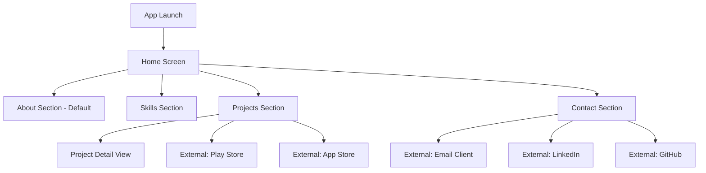

# Design Document: Flutter Portfolio App

## Overview

The Flutter Portfolio App is a mobile application that showcases a Flutter developer's professional work, skills, and contact information. The app follows modern mobile design principles with a clean, minimalist aesthetic, smooth animations, and support for both light and dark themes.

The architecture follows Flutter best practices with a clear separation between presentation, business logic, and data layers. The app uses a feature-based folder structure for maintainability and scalability.

### Key Design Principles

1. **Separation of Concerns**: Clear boundaries between UI, business logic, and data
2. **Responsive Design**: Adaptive layouts that work across different screen sizes
3. **Theme Support**: Comprehensive light and dark mode implementation
4. **Performance**: Optimized image loading and smooth 60 FPS animations
5. **Maintainability**: Content-driven architecture allowing easy updates
6. **Accessibility**: WCAG-compliant contrast ratios and semantic structure

## Architecture

### High-Level Architecture

The app follows a layered architecture pattern:

```
┌─────────────────────────────────────┐
│      Presentation Layer             │
│  (Widgets, Screens, Animations)     │
└─────────────────────────────────────┘
              ↓
┌─────────────────────────────────────┐
│      Business Logic Layer           │
│  (State Management, Navigation)     │
└─────────────────────────────────────┘
              ↓
┌─────────────────────────────────────┐
│         Data Layer                  │
│  (Models, Data Sources, Services)   │
└─────────────────────────────────────┘
```

### Folder Structure

```
lib/
├── main.dart                          # App entry point
├── app.dart                           # Root app widget with theme configuration
├── core/
│   ├── constants/
│   │   ├── app_colors.dart           # Color palette definitions
│   │   ├── app_text_styles.dart      # Typography definitions
│   │   ├── app_dimensions.dart       # Spacing and sizing constants
│   │   └── app_animations.dart       # Animation duration constants
│   ├── theme/
│   │   ├── light_theme.dart          # Light theme configuration
│   │   └── dark_theme.dart           # Dark theme configuration
│   └── utils/
│       ├── url_launcher_helper.dart  # External URL handling
│       └── responsive_helper.dart    # Screen size utilities
├── data/
│   ├── models/
│   │   ├── project.dart              # Project data model
│   │   ├── skill.dart                # Skill data model
│   │   ├── contact_info.dart         # Contact information model
│   │   └── about_info.dart           # About section data model
│   └── repositories/
│       └── portfolio_repository.dart # Data access layer
├── features/
│   ├── about/
│   │   └── about_section.dart        # About section widget
│   ├── skills/
│   │   ├── skills_section.dart       # Skills section widget
│   │   └── widgets/
│   │       └── skill_chip.dart       # Individual skill chip widget
│   ├── projects/
│   │   ├── projects_section.dart     # Projects section widget
│   │   └── widgets/
│   │       ├── project_card.dart     # Project card widget
│   │       └── store_link_button.dart # App store link button
│   ├── contact/
│   │   ├── contact_section.dart      # Contact section widget
│   │   └── widgets/
│   │       └── contact_item.dart     # Individual contact method widget
│   └── home/
│       ├── home_screen.dart          # Main screen with navigation
│       └── widgets/
│           └── navigation_bar.dart   # Bottom navigation bar
└── widgets/
    ├── animated_section.dart         # Reusable animated container
    ├── responsive_image.dart         # Responsive image widget
    └── loading_indicator.dart        # Custom loading indicator
```

### Navigation Flow



## Components and Interfaces

### Core Data Models

#### Project Model

```dart
class Project {
  final String id;
  final String name;
  final String description;
  final List<String> technologies;
  final List<String> imageUrls;
  final String? playStoreUrl;
  final String? appStoreUrl;
  final int displayOrder;

  Project({
    required this.id,
    required this.name,
    required this.description,
    required this.technologies,
    required this.imageUrls,
    this.playStoreUrl,
    this.appStoreUrl,
    required this.displayOrder,
  });

  factory Project.fromJson(Map<String, dynamic> json);
  Map<String, dynamic> toJson();
}
```

#### Skill Model

```dart
class Skill {
  final String id;
  final String name;
  final String category;
  final int displayOrder;

  Skill({
    required this.id,
    required this.name,
    required this.category,
    required this.displayOrder,
  });

  factory Skill.fromJson(Map<String, dynamic> json);
  Map<String, dynamic> toJson();
}
```

#### ContactInfo Model

```dart
class ContactInfo {
  final String email;
  final String? linkedInUrl;
  final String? githubUrl;
  final String? twitterUrl;
  final String? websiteUrl;

  ContactInfo({
    required this.email,
    this.linkedInUrl,
    this.githubUrl,
    this.twitterUrl,
    this.websiteUrl,
  });

  factory ContactInfo.fromJson(Map<String, dynamic> json);
  Map<String, dynamic> toJson();
}
```

#### AboutInfo Model

```dart
class AboutInfo {
  final String name;
  final String title;
  final String bio;
  final String summary;
  final String? profileImageUrl;

  AboutInfo({
    required this.name,
    required this.title,
    required this.bio,
    required this.summary,
    this.profileImageUrl,
  });

  factory AboutInfo.fromJson(Map<String, dynamic> json);
  Map<String, dynamic> toJson();
}
```

### Repository Layer

#### PortfolioRepository

```dart
class PortfolioRepository {
  // Singleton pattern for global access
  static final PortfolioRepository _instance = PortfolioRepository._internal();
  factory PortfolioRepository() => _instance;
  PortfolioRepository._internal();

  // Data storage (in-memory for now, can be extended to local storage)
  AboutInfo? _aboutInfo;
  List<Skill> _skills = [];
  List<Project> _projects = [];
  ContactInfo? _contactInfo;

  // Getters
  AboutInfo getAboutInfo();
  List<Skill> getSkills();
  List<Project> getProjects();
  ContactInfo getContactInfo();

  // Initialize with hardcoded data
  void initialize();
}
```

### Presentation Layer Components

#### HomeScreen

The main screen that hosts all sections and manages navigation.

```dart
class HomeScreen extends StatefulWidget {
  @override
  State<HomeScreen> createState() => _HomeScreenState();
}

class _HomeScreenState extends State<HomeScreen> {
  int _currentIndex = 0;
  final PageController _pageController = PageController();

  void _onNavigationTap(int index);
  void _onPageChanged(int index);

  @override
  Widget build(BuildContext context) {
    return Scaffold(
      body: PageView(
        controller: _pageController,
        onPageChanged: _onPageChanged,
        children: [
          AboutSection(),
          SkillsSection(),
          ProjectsSection(),
          ContactSection(),
        ],
      ),
      bottomNavigationBar: CustomNavigationBar(
        currentIndex: _currentIndex,
        onTap: _onNavigationTap,
      ),
    );
  }
}
```

#### AboutSection

Displays professional introduction and bio.

```dart
class AboutSection extends StatelessWidget {
  @override
  Widget build(BuildContext context) {
    final aboutInfo = PortfolioRepository().getAboutInfo();
    
    return AnimatedSection(
      child: SingleChildScrollView(
        padding: EdgeInsets.all(AppDimensions.pagePadding),
        child: Column(
          crossAxisAlignment: CrossAxisAlignment.start,
          children: [
            // Profile image (if available)
            if (aboutInfo.profileImageUrl != null)
              ResponsiveImage(url: aboutInfo.profileImageUrl!),
            
            // Name
            Text(aboutInfo.name, style: AppTextStyles.heading1),
            
            // Title
            Text(aboutInfo.title, style: AppTextStyles.subtitle),
            
            // Bio
            Text(aboutInfo.bio, style: AppTextStyles.body),
            
            // Summary
            Text(aboutInfo.summary, style: AppTextStyles.body),
          ],
        ),
      ),
    );
  }
}
```

#### SkillsSection

Displays technical skills as visual chips.

```dart
class SkillsSection extends StatelessWidget {
  @override
  Widget build(BuildContext context) {
    final skills = PortfolioRepository().getSkills();
    
    return AnimatedSection(
      child: SingleChildScrollView(
        padding: EdgeInsets.all(AppDimensions.pagePadding),
        child: Column(
          crossAxisAlignment: CrossAxisAlignment.start,
          children: [
            Text('Skills', style: AppTextStyles.heading1),
            SizedBox(height: AppDimensions.sectionSpacing),
            Wrap(
              spacing: AppDimensions.chipSpacing,
              runSpacing: AppDimensions.chipSpacing,
              children: skills.map((skill) => SkillChip(skill: skill)).toList(),
            ),
          ],
        ),
      ),
    );
  }
}
```

#### SkillChip

Individual skill display component.

```dart
class SkillChip extends StatelessWidget {
  final Skill skill;

  const SkillChip({required this.skill});

  @override
  Widget build(BuildContext context) {
    return Container(
      padding: EdgeInsets.symmetric(
        horizontal: AppDimensions.chipPaddingHorizontal,
        vertical: AppDimensions.chipPaddingVertical,
      ),
      decoration: BoxDecoration(
        color: Theme.of(context).colorScheme.primaryContainer,
        borderRadius: BorderRadius.circular(AppDimensions.chipBorderRadius),
      ),
      child: Text(
        skill.name,
        style: AppTextStyles.chip,
      ),
    );
  }
}
```

#### ProjectsSection

Displays list of published projects.

```dart
class ProjectsSection extends StatelessWidget {
  @override
  Widget build(BuildContext context) {
    final projects = PortfolioRepository().getProjects();
    
    return AnimatedSection(
      child: ListView.builder(
        padding: EdgeInsets.all(AppDimensions.pagePadding),
        itemCount: projects.length + 1, // +1 for header
        itemBuilder: (context, index) {
          if (index == 0) {
            return Padding(
              padding: EdgeInsets.only(bottom: AppDimensions.sectionSpacing),
              child: Text('Projects', style: AppTextStyles.heading1),
            );
          }
          return ProjectCard(project: projects[index - 1]);
        },
      ),
    );
  }
}
```

#### ProjectCard

Displays individual project information.

```dart
class ProjectCard extends StatelessWidget {
  final Project project;

  const ProjectCard({required this.project});

  @override
  Widget build(BuildContext context) {
    return Card(
      margin: EdgeInsets.only(bottom: AppDimensions.cardSpacing),
      child: Padding(
        padding: EdgeInsets.all(AppDimensions.cardPadding),
        child: Column(
          crossAxisAlignment: CrossAxisAlignment.start,
          children: [
            // Project image
            if (project.imageUrls.isNotEmpty)
              ResponsiveImage(
                url: project.imageUrls.first,
                aspectRatio: 16 / 9,
              ),
            
            SizedBox(height: AppDimensions.contentSpacing),
            
            // Project name
            Text(project.name, style: AppTextStyles.heading2),
            
            SizedBox(height: AppDimensions.contentSpacing),
            
            // Description
            Text(project.description, style: AppTextStyles.body),
            
            SizedBox(height: AppDimensions.contentSpacing),
            
            // Technologies
            Wrap(
              spacing: AppDimensions.chipSpacing,
              runSpacing: AppDimensions.chipSpacing,
              children: project.technologies
                  .map((tech) => Chip(label: Text(tech)))
                  .toList(),
            ),
            
            SizedBox(height: AppDimensions.contentSpacing),
            
            // Store links
            Row(
              children: [
                if (project.playStoreUrl != null)
                  StoreLinkButton(
                    url: project.playStoreUrl!,
                    platform: StorePlatform.playStore,
                  ),
                if (project.playStoreUrl != null && project.appStoreUrl != null)
                  SizedBox(width: AppDimensions.buttonSpacing),
                if (project.appStoreUrl != null)
                  StoreLinkButton(
                    url: project.appStoreUrl!,
                    platform: StorePlatform.appStore,
                  ),
              ],
            ),
          ],
        ),
      ),
    );
  }
}
```

#### StoreLinkButton

Button for opening app store links.

```dart
enum StorePlatform { playStore, appStore }

class StoreLinkButton extends StatelessWidget {
  final String url;
  final StorePlatform platform;

  const StoreLinkButton({
    required this.url,
    required this.platform,
  });

  Future<void> _launchUrl() async {
    await UrlLauncherHelper.launchExternalUrl(url);
  }

  @override
  Widget build(BuildContext context) {
    final icon = platform == StorePlatform.playStore
        ? Icons.shop
        : Icons.apple;
    final label = platform == StorePlatform.playStore
        ? 'Play Store'
        : 'App Store';

    return ElevatedButton.icon(
      onPressed: _launchUrl,
      icon: Icon(icon),
      label: Text(label),
    );
  }
}
```

#### ContactSection

Displays contact methods and social links.

```dart
class ContactSection extends StatelessWidget {
  @override
  Widget build(BuildContext context) {
    final contactInfo = PortfolioRepository().getContactInfo();
    
    return AnimatedSection(
      child: SingleChildScrollView(
        padding: EdgeInsets.all(AppDimensions.pagePadding),
        child: Column(
          crossAxisAlignment: CrossAxisAlignment.start,
          children: [
            Text('Contact', style: AppTextStyles.heading1),
            SizedBox(height: AppDimensions.sectionSpacing),
            
            ContactItem(
              icon: Icons.email,
              label: 'Email',
              value: contactInfo.email,
              onTap: () => UrlLauncherHelper.launchEmail(contactInfo.email),
            ),
            
            if (contactInfo.linkedInUrl != null)
              ContactItem(
                icon: Icons.work,
                label: 'LinkedIn',
                value: 'View Profile',
                onTap: () => UrlLauncherHelper.launchExternalUrl(
                  contactInfo.linkedInUrl!,
                ),
              ),
            
            if (contactInfo.githubUrl != null)
              ContactItem(
                icon: Icons.code,
                label: 'GitHub',
                value: 'View Profile',
                onTap: () => UrlLauncherHelper.launchExternalUrl(
                  contactInfo.githubUrl!,
                ),
              ),
          ],
        ),
      ),
    );
  }
}
```

#### ContactItem

Individual contact method display.

```dart
class ContactItem extends StatelessWidget {
  final IconData icon;
  final String label;
  final String value;
  final VoidCallback onTap;

  const ContactItem({
    required this.icon,
    required this.label,
    required this.value,
    required this.onTap,
  });

  @override
  Widget build(BuildContext context) {
    return InkWell(
      onTap: onTap,
      child: Padding(
        padding: EdgeInsets.symmetric(vertical: AppDimensions.listItemPadding),
        child: Row(
          children: [
            Icon(icon, size: AppDimensions.iconSize),
            SizedBox(width: AppDimensions.contentSpacing),
            Expanded(
              child: Column(
                crossAxisAlignment: CrossAxisAlignment.start,
                children: [
                  Text(label, style: AppTextStyles.caption),
                  Text(value, style: AppTextStyles.body),
                ],
              ),
            ),
            Icon(Icons.arrow_forward_ios, size: AppDimensions.iconSizeSmall),
          ],
        ),
      ),
    );
  }
}
```

### Utility Components

#### AnimatedSection

Provides entrance animations for sections.

```dart
class AnimatedSection extends StatefulWidget {
  final Widget child;

  const AnimatedSection({required this.child});

  @override
  State<AnimatedSection> createState() => _AnimatedSectionState();
}

class _AnimatedSectionState extends State<AnimatedSection>
    with SingleTickerProviderStateMixin {
  late AnimationController _controller;
  late Animation<double> _fadeAnimation;
  late Animation<Offset> _slideAnimation;

  @override
  void initState() {
    super.initState();
    _controller = AnimationController(
      duration: AppAnimations.sectionTransitionDuration,
      vsync: this,
    );

    _fadeAnimation = Tween<double>(begin: 0.0, end: 1.0).animate(
      CurvedAnimation(parent: _controller, curve: Curves.easeIn),
    );

    _slideAnimation = Tween<Offset>(
      begin: Offset(0, 0.1),
      end: Offset.zero,
    ).animate(
      CurvedAnimation(parent: _controller, curve: Curves.easeOut),
    );

    _controller.forward();
  }

  @override
  void dispose() {
    _controller.dispose();
    super.dispose();
  }

  @override
  Widget build(BuildContext context) {
    return FadeTransition(
      opacity: _fadeAnimation,
      child: SlideTransition(
        position: _slideAnimation,
        child: widget.child,
      ),
    );
  }
}
```

#### ResponsiveImage

Handles responsive image display with loading states.

```dart
class ResponsiveImage extends StatelessWidget {
  final String url;
  final double? aspectRatio;

  const ResponsiveImage({
    required this.url,
    this.aspectRatio,
  });

  @override
  Widget build(BuildContext context) {
    final screenWidth = MediaQuery.of(context).size.width;
    final imageWidth = screenWidth - (AppDimensions.pagePadding * 2);

    return ClipRRect(
      borderRadius: BorderRadius.circular(AppDimensions.imageBorderRadius),
      child: AspectRatio(
        aspectRatio: aspectRatio ?? 1.0,
        child: Image.network(
          url,
          width: imageWidth,
          fit: BoxFit.cover,
          loadingBuilder: (context, child, loadingProgress) {
            if (loadingProgress == null) return child;
            return Center(child: LoadingIndicator());
          },
          errorBuilder: (context, error, stackTrace) {
            return Container(
              color: Theme.of(context).colorScheme.surfaceVariant,
              child: Center(
                child: Icon(
                  Icons.image_not_supported,
                  size: AppDimensions.iconSizeLarge,
                  color: Theme.of(context).colorScheme.onSurfaceVariant,
                ),
              ),
            );
          },
        ),
      ),
    );
  }
}
```

#### UrlLauncherHelper

Utility for launching external URLs.

```dart
class UrlLauncherHelper {
  static Future<bool> launchExternalUrl(String url) async {
    final uri = Uri.parse(url);
    if (await canLaunchUrl(uri)) {
      return await launchUrl(uri, mode: LaunchMode.externalApplication);
    }
    return false;
  }

  static Future<bool> launchEmail(String email) async {
    final uri = Uri(scheme: 'mailto', path: email);
    if (await canLaunchUrl(uri)) {
      return await launchUrl(uri);
    }
    return false;
  }
}
```

## Data Models

### Portfolio Data Structure

The portfolio data is stored in JSON format for easy maintenance:

```json
{
  "about": {
    "name": "Developer Name",
    "title": "Flutter Developer",
    "bio": "Passionate Flutter developer with expertise in building cross-platform mobile applications...",
    "summary": "Specialized in creating performant, beautiful mobile experiences...",
    "profileImageUrl": null
  },
  "skills": [
    {
      "id": "1",
      "name": "Flutter",
      "category": "Framework",
      "displayOrder": 1
    },
    {
      "id": "2",
      "name": "Dart",
      "category": "Language",
      "displayOrder": 2
    }
  ],
  "projects": [
    {
      "id": "1",
      "name": "Watt Audit",
      "description": "Energy audit and management application",
      "technologies": ["Flutter", "Firebase", "REST API"],
      "imageUrls": [],
      "playStoreUrl": "https://play.google.com/store/apps/details?id=io.hexasoft.ceert_audit",
      "appStoreUrl": "https://apps.apple.com/pk/app/watt-audit/id6449857114",
      "displayOrder": 1
    },
    {
      "id": "2",
      "name": "CEERTIFS",
      "description": "Certification and compliance management system",
      "technologies": ["Flutter", "Firebase", "Cloud Functions"],
      "imageUrls": [],
      "playStoreUrl": "https://play.google.com/store/apps/details?id=com.hexasoft.bch",
      "appStoreUrl": "https://apps.apple.com/pk/app/ceertifs/id1456381091",
      "displayOrder": 2
    }
  ],
  "contact": {
    "email": "developer@example.com",
    "linkedInUrl": "https://linkedin.com/in/developer",
    "githubUrl": "https://github.com/developer",
    "twitterUrl": null,
    "websiteUrl": null
  }
}
```

### Model Validation Rules

Each model includes validation logic:

1. **Project**: 
   - Name must be non-empty
   - Description must be at least 10 characters
   - At least one store URL must be provided
   - Technologies list must not be empty

2. **Skill**:
   - Name must be non-empty
   - Category must be non-empty

3. **ContactInfo**:
   - Email must be valid format
   - URLs must be valid format when provided

4. **AboutInfo**:
   - Name must be non-empty
   - Bio must be at least 50 characters
   - Summary must be non-empty

## Theme System

### Color Palette

```dart
class AppColors {
  // Light theme colors
  static const Color lightPrimary = Color(0xFF6200EE);
  static const Color lightOnPrimary = Color(0xFFFFFFFF);
  static const Color lightPrimaryContainer = Color(0xFFBB86FC);
  static const Color lightSecondary = Color(0xFF03DAC6);
  static const Color lightBackground = Color(0xFFFFFFFF);
  static const Color lightSurface = Color(0xFFF5F5F5);
  static const Color lightOnSurface = Color(0xFF000000);

  // Dark theme colors
  static const Color darkPrimary = Color(0xFFBB86FC);
  static const Color darkOnPrimary = Color(0xFF000000);
  static const Color darkPrimaryContainer = Color(0xFF3700B3);
  static const Color darkSecondary = Color(0xFF03DAC6);
  static const Color darkBackground = Color(0xFF121212);
  static const Color darkSurface = Color(0xFF1E1E1E);
  static const Color darkOnSurface = Color(0xFFFFFFFF);
}
```

### Typography

```dart
class AppTextStyles {
  static const TextStyle heading1 = TextStyle(
    fontSize: 32,
    fontWeight: FontWeight.bold,
    height: 1.2,
  );

  static const TextStyle heading2 = TextStyle(
    fontSize: 24,
    fontWeight: FontWeight.bold,
    height: 1.3,
  );

  static const TextStyle subtitle = TextStyle(
    fontSize: 18,
    fontWeight: FontWeight.w500,
    height: 1.4,
  );

  static const TextStyle body = TextStyle(
    fontSize: 16,
    fontWeight: FontWeight.normal,
    height: 1.5,
  );

  static const TextStyle caption = TextStyle(
    fontSize: 14,
    fontWeight: FontWeight.normal,
    height: 1.4,
  );

  static const TextStyle chip = TextStyle(
    fontSize: 14,
    fontWeight: FontWeight.w500,
  );
}
```

### Dimensions

```dart
class AppDimensions {
  // Padding
  static const double pagePadding = 16.0;
  static const double cardPadding = 16.0;
  static const double chipPaddingHorizontal = 16.0;
  static const double chipPaddingVertical = 8.0;
  static const double listItemPadding = 12.0;

  // Spacing
  static const double sectionSpacing = 24.0;
  static const double contentSpacing = 12.0;
  static const double cardSpacing = 16.0;
  static const double chipSpacing = 8.0;
  static const double buttonSpacing = 12.0;

  // Border radius
  static const double chipBorderRadius = 20.0;
  static const double cardBorderRadius = 12.0;
  static const double imageBorderRadius = 8.0;

  // Icon sizes
  static const double iconSize = 24.0;
  static const double iconSizeSmall = 16.0;
  static const double iconSizeLarge = 48.0;

  // Touch targets
  static const double minTouchTarget = 48.0;
}
```

### Animation Configuration

```dart
class AppAnimations {
  static const Duration sectionTransitionDuration = Duration(milliseconds: 400);
  static const Duration pageTransitionDuration = Duration(milliseconds: 300);
  static const Duration buttonPressDuration = Duration(milliseconds: 100);
  static const Duration imageFadeDuration = Duration(milliseconds: 200);

  static const Curve defaultCurve = Curves.easeInOut;
  static const Curve entranceCurve = Curves.easeOut;
  static const Curve exitCurve = Curves.easeIn;
}
```

### Responsive Breakpoints

```dart
class ResponsiveHelper {
  static const double mobileMaxWidth = 600;
  static const double tabletMaxWidth = 1024;

  static bool isMobile(BuildContext context) {
    return MediaQuery.of(context).size.width < mobileMaxWidth;
  }

  static bool isTablet(BuildContext context) {
    final width = MediaQuery.of(context).size.width;
    return width >= mobileMaxWidth && width < tabletMaxWidth;
  }

  static bool isDesktop(BuildContext context) {
    return MediaQuery.of(context).size.width >= tabletMaxWidth;
  }

  static double getResponsivePadding(BuildContext context) {
    if (isMobile(context)) return AppDimensions.pagePadding;
    if (isTablet(context)) return AppDimensions.pagePadding * 1.5;
    return AppDimensions.pagePadding * 2;
  }
}
```


## Correctness Properties

A property is a characteristic or behavior that should hold true across all valid executions of a system—essentially, a formal statement about what the system should do. Properties serve as the bridge between human-readable specifications and machine-verifiable correctness guarantees.

### Data Validation Properties

**Property 1: AboutInfo Bio Length Validation**

*For any* AboutInfo instance, the bio field must contain at least 50 characters.

**Validates: Requirements 1.3**

**Property 2: Skills List Capacity**

*For any* list of skills with size N where N >= 10, the Skills_Section must successfully render all N skills without errors.

**Validates: Requirements 2.3**

**Property 3: Projects List Display Completeness**

*For any* list of projects in the repository, the Projects_Section must render a Project_Card for each project in the list.

**Validates: Requirements 3.1, 3.2**

**Property 4: Project Card Content Completeness**

*For any* Project instance, its Project_Card must display all required fields: name, description, at least one image (if imageUrls is non-empty), and all technologies from the technologies list.

**Validates: Requirements 3.3, 3.4, 3.5, 3.6**

**Property 5: Minimum Projects Support**

*For any* list of projects with size N where N >= 2, the Portfolio_App must successfully display all projects without errors.

**Validates: Requirements 3.7**

**Property 6: Store Link Conditional Display**

*For any* Project instance, a Store_Link for Play Store must be displayed if and only if playStoreUrl is non-null, and a Store_Link for App Store must be displayed if and only if appStoreUrl is non-null.

**Validates: Requirements 4.1, 4.2, 4.4**

**Property 7: Store Link URL Launching**

*For any* valid store URL (Play Store or App Store), when the corresponding Store_Link is tapped, the UrlLauncherHelper must attempt to open that URL.

**Validates: Requirements 4.3**

**Property 8: Contact Methods Display**

*For any* ContactInfo instance with N non-null contact fields (where N >= 2), the Contact_Section must display all N contact methods.

**Validates: Requirements 5.3**

**Property 9: Contact Method Action Triggering**

*For any* contact method (email, LinkedIn, GitHub, etc.), when tapped, the Portfolio_App must trigger the appropriate action (email client for email, browser for URLs).

**Validates: Requirements 5.4, 5.5**

### Navigation Properties

**Property 10: Navigation Section Transitions**

*For any* valid navigation index (0-3 representing About, Skills, Projects, Contact), when that navigation item is selected, the PageController must transition to the corresponding page index.

**Validates: Requirements 6.2**

**Property 11: Navigation Active State Indication**

*For any* currently displayed section index, the Navigation_System must indicate that section as active (currentIndex matches the displayed page).

**Validates: Requirements 6.3**

### Responsive Design Properties

**Property 12: Screen Width Adaptation**

*For any* screen width W where 320 <= W <= 1024 pixels, the Responsive_Layout must render all content without overflow errors.

**Validates: Requirements 7.1**

**Property 13: Responsive Image Sizing**

*For any* image and screen width, the ResponsiveImage widget must calculate image width as (screenWidth - 2 * pagePadding) to ensure proper sizing within available space.

**Validates: Requirements 7.5**

**Property 14: Orientation Change Handling**

*For any* device orientation change (portrait to landscape or vice versa), the Portfolio_App must trigger a rebuild that reflows content to the new dimensions.

**Validates: Requirements 7.6**

### Theme Properties

**Property 15: System Theme Reactivity**

*For any* system theme change event (light to dark or dark to light), the Portfolio_App must update its active theme to match the new system preference.

**Validates: Requirements 8.5**

**Property 16: Contrast Ratio Compliance**

*For any* text element in both Light_Mode and Dark_Mode, the contrast ratio between text color and background color must be at least 4.5:1.

**Validates: Requirements 8.7, 14.4**

### Animation Properties

**Property 17: Interactive Element Feedback**

*For any* interactive element (button, link, card), when tapped, the element must provide visual feedback through animation or state change.

**Validates: Requirements 9.3**

**Property 18: Animation Duration Constraint**

*For any* animation in the Animation_System, the duration must be less than or equal to 500 milliseconds.

**Validates: Requirements 9.4**

### Image Handling Properties

**Property 19: Image Aspect Ratio Preservation**

*For any* image with original aspect ratio R, when displayed by ResponsiveImage with aspectRatio parameter A, the rendered image must maintain aspect ratio A (or R if A is null).

**Validates: Requirements 10.2**

**Property 20: Image Load Failure Handling**

*For any* image URL that fails to load, the ResponsiveImage widget must display a placeholder icon instead of crashing or showing blank space.

**Validates: Requirements 10.4, 13.2**

**Property 21: Multiple Images Support**

*For any* Project with N images where N > 1, all N images must be accessible and displayable in the project card or detail view.

**Validates: Requirements 10.5**

**Property 22: Image Tap Enlargement**

*For any* project image displayed in a Project_Card, when tapped, the image must be displayed in a larger view (full screen or dialog).

**Validates: Requirements 10.6**

### Content Management Properties

**Property 23: Data Model Serialization Round-Trip**

*For any* valid data model instance (Project, Skill, ContactInfo, or AboutInfo), serializing to JSON and then deserializing must produce an equivalent object.

**Validates: Requirements 11.1**

**Property 24: Dynamic Content Updates**

*For any* change to the portfolio data in PortfolioRepository, when the UI rebuilds, it must reflect the updated data without requiring code changes to UI components.

**Validates: Requirements 11.3**

**Property 25: New Project Addition**

*For any* new Project instance added to the PortfolioRepository, the Projects_Section must display a Project_Card for that project on the next build.

**Validates: Requirements 11.4**

**Property 26: Project Update Reflection**

*For any* existing Project instance with updated fields, the corresponding Project_Card must display the updated values on the next build.

**Validates: Requirements 11.5**

### Performance Properties

**Property 27: Image Caching**

*For any* image URL that has been successfully loaded once, subsequent requests for the same URL must use the cached version rather than re-downloading.

**Validates: Requirements 12.4**

### Error Handling Properties

**Property 28: External Link Error Handling**

*For any* external URL (store link or contact link) that fails to open, the Portfolio_App must display an error message to the user and continue functioning normally.

**Validates: Requirements 13.1, 13.3**

**Property 29: Error Logging**

*For any* error that occurs during app execution, the error must be logged with sufficient context for debugging.

**Validates: Requirements 13.4**

**Property 30: Error Resilience**

*For any* error that occurs during app execution, the Portfolio_App must handle the error gracefully without crashing or becoming unresponsive.

**Validates: Requirements 13.5**

### Accessibility Properties

**Property 31: Interactive Element Semantic Labels**

*For any* interactive widget (button, link, navigation item), the widget must have a non-empty semantic label for screen reader accessibility.

**Validates: Requirements 14.1**

**Property 32: Touch Target Size Compliance**

*For any* interactive element, the minimum touch target size must be at least 48x48 pixels.

**Validates: Requirements 14.3**

**Property 33: Section Change Announcements**

*For any* navigation between sections, the Portfolio_App must update semantic properties to announce the section change to screen readers.

**Validates: Requirements 14.5**

**Property 34: Text Scaling Support**

*For any* text scale factor F where 1.0 <= F <= 2.0, the Portfolio_App must render all text at the scaled size without layout overflow.

**Validates: Requirements 14.6**

## Error Handling

### Error Categories

1. **Network Errors**: Image loading failures, external URL launch failures
2. **Data Validation Errors**: Invalid model data, missing required fields
3. **Platform Errors**: URL launcher not available, email client not configured
4. **UI Errors**: Widget build errors, animation errors

### Error Handling Strategy

#### Image Loading Errors

```dart
// In ResponsiveImage widget
errorBuilder: (context, error, stackTrace) {
  // Log error for debugging
  debugPrint('Image load failed: $url, Error: $error');
  
  // Display placeholder
  return Container(
    color: Theme.of(context).colorScheme.surfaceVariant,
    child: Center(
      child: Icon(
        Icons.image_not_supported,
        size: AppDimensions.iconSizeLarge,
        color: Theme.of(context).colorScheme.onSurfaceVariant,
      ),
    ),
  );
}
```

#### URL Launch Errors

```dart
// In UrlLauncherHelper
static Future<bool> launchExternalUrl(String url) async {
  try {
    final uri = Uri.parse(url);
    if (await canLaunchUrl(uri)) {
      return await launchUrl(uri, mode: LaunchMode.externalApplication);
    } else {
      _showErrorSnackBar('Cannot open this link');
      return false;
    }
  } catch (e) {
    debugPrint('URL launch failed: $url, Error: $e');
    _showErrorSnackBar('Failed to open link');
    return false;
  }
}

static void _showErrorSnackBar(String message) {
  // Show user-friendly error message
  // Implementation depends on having access to ScaffoldMessenger
}
```

#### Data Validation Errors

```dart
// In model constructors
class Project {
  Project({
    required this.id,
    required this.name,
    required this.description,
    required this.technologies,
    required this.imageUrls,
    this.playStoreUrl,
    this.appStoreUrl,
    required this.displayOrder,
  }) {
    // Validation
    if (name.isEmpty) {
      throw ArgumentError('Project name cannot be empty');
    }
    if (description.length < 10) {
      throw ArgumentError('Project description must be at least 10 characters');
    }
    if (technologies.isEmpty) {
      throw ArgumentError('Project must have at least one technology');
    }
    if (playStoreUrl == null && appStoreUrl == null) {
      throw ArgumentError('Project must have at least one store URL');
    }
  }
}
```

#### Widget Build Errors

```dart
// Use ErrorWidget.builder for global error handling
void main() {
  ErrorWidget.builder = (FlutterErrorDetails details) {
    return Container(
      color: Colors.red.shade100,
      child: Center(
        child: Text(
          'An error occurred',
          style: TextStyle(color: Colors.red.shade900),
        ),
      ),
    );
  };
  
  runApp(PortfolioApp());
}
```

### Error Recovery

1. **Graceful Degradation**: Show placeholders for failed images, hide unavailable links
2. **User Feedback**: Display clear error messages via SnackBars or Dialogs
3. **Logging**: Log all errors with context for debugging
4. **Retry Mechanisms**: Allow users to retry failed operations (e.g., refresh images)
5. **Fallback Content**: Provide default content when data is unavailable

## Testing Strategy

### Dual Testing Approach

The testing strategy employs both unit tests and property-based tests to ensure comprehensive coverage:

- **Unit Tests**: Verify specific examples, edge cases, and integration points
- **Property-Based Tests**: Verify universal properties across randomized inputs

Both approaches are complementary and necessary for comprehensive correctness validation.

### Property-Based Testing

Property-based tests validate that correctness properties hold across many generated inputs. We will use the **test** package with custom generators for property-based testing in Dart/Flutter.

**Configuration**:
- Minimum 100 iterations per property test
- Each test references its design document property
- Tag format: `@Tags(['feature:flutter-portfolio-app', 'property:N'])`

**Example Property Test Structure**:

```dart
import 'package:test/test.dart';
import 'package:flutter_test/flutter_test.dart';

// Feature: flutter-portfolio-app, Property 1: AboutInfo Bio Length Validation
@Tags(['feature:flutter-portfolio-app', 'property:1'])
void main() {
  group('Property 1: AboutInfo Bio Length Validation', () {
    test('bio must be at least 50 characters', () {
      // Generate 100 random AboutInfo instances
      for (int i = 0; i < 100; i++) {
        final aboutInfo = generateRandomAboutInfo();
        
        // Property: bio length >= 50
        expect(aboutInfo.bio.length, greaterThanOrEqualTo(50));
      }
    });
  });
}
```

### Unit Testing

Unit tests focus on specific examples, edge cases, and component integration.

**Test Categories**:

1. **Model Tests**: Serialization, validation, edge cases
2. **Widget Tests**: UI rendering, user interactions, visual states
3. **Integration Tests**: Component interactions, navigation flows
4. **Accessibility Tests**: Semantic labels, contrast ratios, touch targets

**Example Unit Test Structure**:

```dart
import 'package:flutter_test/flutter_test.dart';

void main() {
  group('Project Model', () {
    test('should create valid project from JSON', () {
      final json = {
        'id': '1',
        'name': 'Test App',
        'description': 'A test application for unit testing',
        'technologies': ['Flutter', 'Dart'],
        'imageUrls': ['https://example.com/image.png'],
        'playStoreUrl': 'https://play.google.com/store/apps/details?id=com.test',
        'appStoreUrl': null,
        'displayOrder': 1,
      };
      
      final project = Project.fromJson(json);
      
      expect(project.name, 'Test App');
      expect(project.technologies.length, 2);
      expect(project.appStoreUrl, isNull);
    });
    
    test('should throw error for empty name', () {
      expect(
        () => Project(
          id: '1',
          name: '',
          description: 'Valid description',
          technologies: ['Flutter'],
          imageUrls: [],
          playStoreUrl: 'https://play.google.com/store',
          displayOrder: 1,
        ),
        throwsArgumentError,
      );
    });
  });
}
```

### Test Coverage Goals

- **Model Layer**: 100% coverage (all validation rules, serialization)
- **Repository Layer**: 100% coverage (all data access methods)
- **Widget Layer**: 80%+ coverage (all user interactions, key rendering paths)
- **Utility Layer**: 100% coverage (all helper functions)

### Testing Tools and Dependencies

```yaml
dev_dependencies:
  flutter_test:
    sdk: flutter
  test: ^1.24.0
  mockito: ^5.4.0
  build_runner: ^2.4.0
```

### Continuous Testing

- Run unit tests on every commit
- Run property tests on every pull request
- Generate coverage reports for all test runs
- Maintain minimum 80% overall code coverage

### Test Organization

```
test/
├── models/
│   ├── project_test.dart
│   ├── skill_test.dart
│   ├── contact_info_test.dart
│   └── about_info_test.dart
├── repositories/
│   └── portfolio_repository_test.dart
├── widgets/
│   ├── about_section_test.dart
│   ├── skills_section_test.dart
│   ├── projects_section_test.dart
│   ├── contact_section_test.dart
│   └── project_card_test.dart
├── properties/
│   ├── data_validation_properties_test.dart
│   ├── navigation_properties_test.dart
│   ├── responsive_properties_test.dart
│   ├── theme_properties_test.dart
│   ├── animation_properties_test.dart
│   ├── image_properties_test.dart
│   ├── content_management_properties_test.dart
│   ├── error_handling_properties_test.dart
│   └── accessibility_properties_test.dart
└── integration/
    ├── navigation_flow_test.dart
    └── theme_switching_test.dart
```

### Property Test Generators

Custom generators for property-based testing:

```dart
// Generator utilities
class PropertyTestGenerators {
  static AboutInfo generateRandomAboutInfo() {
    return AboutInfo(
      name: _randomString(10, 30),
      title: _randomString(10, 50),
      bio: _randomString(50, 200), // Ensures minimum 50 chars
      summary: _randomString(20, 100),
      profileImageUrl: _randomBool() ? _randomUrl() : null,
    );
  }
  
  static Project generateRandomProject() {
    return Project(
      id: _randomId(),
      name: _randomString(5, 50),
      description: _randomString(10, 200),
      technologies: _randomStringList(1, 10),
      imageUrls: _randomUrlList(0, 5),
      playStoreUrl: _randomBool() ? _randomUrl() : null,
      appStoreUrl: _randomBool() ? _randomUrl() : null,
      displayOrder: _randomInt(1, 100),
    );
  }
  
  static Skill generateRandomSkill() {
    return Skill(
      id: _randomId(),
      name: _randomString(3, 30),
      category: _randomString(5, 20),
      displayOrder: _randomInt(1, 100),
    );
  }
  
  static ContactInfo generateRandomContactInfo() {
    return ContactInfo(
      email: _randomEmail(),
      linkedInUrl: _randomBool() ? _randomUrl() : null,
      githubUrl: _randomBool() ? _randomUrl() : null,
      twitterUrl: _randomBool() ? _randomUrl() : null,
      websiteUrl: _randomBool() ? _randomUrl() : null,
    );
  }
  
  // Helper methods
  static String _randomString(int minLength, int maxLength) { /* ... */ }
  static String _randomId() { /* ... */ }
  static String _randomUrl() { /* ... */ }
  static String _randomEmail() { /* ... */ }
  static bool _randomBool() { /* ... */ }
  static int _randomInt(int min, int max) { /* ... */ }
  static List<String> _randomStringList(int minSize, int maxSize) { /* ... */ }
  static List<String> _randomUrlList(int minSize, int maxSize) { /* ... */ }
}
```

This comprehensive testing strategy ensures that the Flutter Portfolio App meets all requirements and maintains high quality through both specific example validation and universal property verification.
